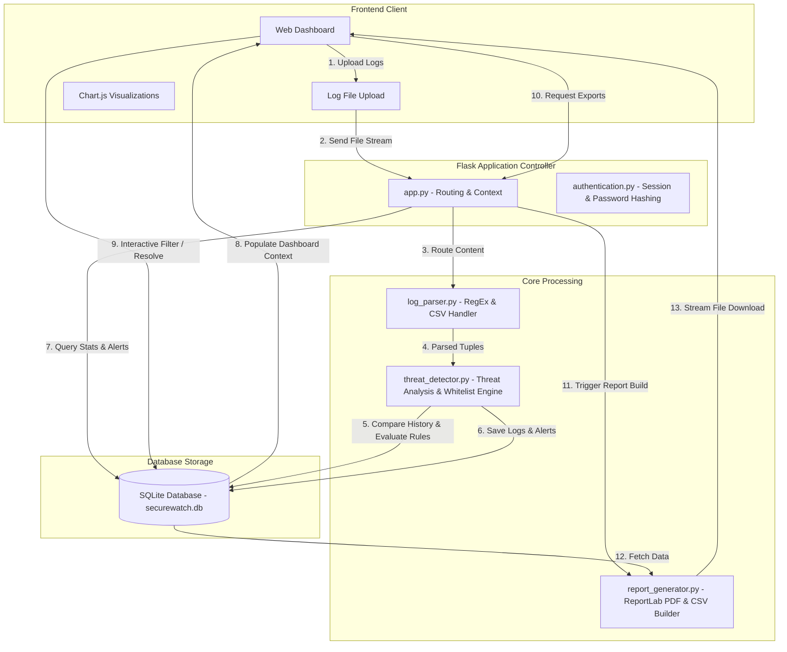

# 🛡️ Z+ Security – Cybersecurity Monitoring Dashboard

[](https://www.python.org/)
[](https://flask.palletsprojects.com/)
[](https://www.sqlite.org/)
[](https://opensource.org/licenses/MIT)
[]()

> **SecureWatch (Z+ Security)** is a robust, lightweight, and modern Security Information and Event Management (SIEM) dashboard designed to parse system access logs, detect security events, flag network threats, and generate compliance-ready threat reports for security operations teams.

---

## 📌 Table of Contents
- [Project Overview](#-project-overview)
- [Core Features](#-core-features)
- [System Architecture](#-system-architecture)
- [Technologies & Libraries Used](#-technologies--libraries-used)
- [Project Structure](#-project-structure)
- [Installation Guide](#-installation-guide)
- [User Guide](#-user-guide)
- [Threat Detection Logic](#-threat-detection-logic)
- [Database Schema Design](#-database-schema-design)
- [Screenshots Section](#-screenshots-section)
- [Future Enhancements](#-future-enhancements)
- [Learning Outcomes](#-learning-outcomes)
- [Resume & Recruiter Impact](#-resume--recruiter-impact)
- [License](#-license)
- [Author](#-author)

---

## 📖 Project Overview

Modern enterprise systems generate millions of log lines daily. Hidden within this volume of data are subtle indicators of compromise (IOCs), brute force attempts, and suspicious network activities. Manual analysis of these raw files is slow, error-prone, and unsustainable for security operations centers (SOCs). 

**Z+ Security (SecureWatch)** solves this problem by serving as a dedicated log analysis engine and visual monitoring platform. It empowers security analysts to:
- **Centralize Threat Intelligence:** Upload unstructured server access logs and automatically extract timestamps, actions, and source IP addresses.
- **Automate Incident Recognition:** Detect brute force attempts, brute force login thresholds, and unauthorized IP addresses out-of-the-box.
- **Minimize Response Lag:** View critical metrics and trends via interactive charts for rapid incident triage.
- **Achieve Compliance Audits:** Instantly export generated alerts into CSV spreadsheets and formal executive PDF reports.

Organizations need tools like Z+ Security to bridge the gap between complex network traffic logs and actionable, high-level threat intelligence.

---

## ✨ Core Features

### 🔐 Security & Identity Control
- **User Authentication System:** Secure registration and login workflows to isolate the dashboard from unauthorized access.
- **Session-Based Authentication:** Uses secure Flask sessions to restrict endpoint access, ensuring that only authenticated security analysts can upload logs or resolve alerts.
- **Password Encryption:** Implements strong hashing using `Werkzeug`'s security utilities (`generate_password_hash` and `check_password_hash`) to protect analyst accounts.

### 📊 Log Analysis & Threat Detection
- **Log File Upload:** Supports uploading raw log files (`.log`, `.txt`) and structured data formats (`.csv`) containing authentication events.
- **Log Parsing Engine:** Robust regular expression parsing and CSV headers matching that extracts (Timestamp, Action, Source IP) automatically.
- **Threat Detection Ruleset:** Correlates real-time file uploads with historical database records to run advanced rule checking.
- **Brute Force Detection:** Identifies rapid-fire credential guessing events (10 failed attempts within a 5-minute window).
- **Suspicious IP Detection:** Automatically flags logins originating from IP addresses not present in the pre-configured network whitelist.

### 🖥️ Operations Dashboard & Reporting
- **Alert Management Dashboard:** An interactive hub showing real-time statistics (Total Logs, Active Threats, High Risk Alerts, and Safe Events).
- **Dynamic Data Visualizations:** Integrated **Chart.js** charts displaying threat distribution percentages and top malicious IPs by failed login frequency.
- **PDF Report Generation:** Compiles an executive-ready PDF document including tables, statistics, colored risk breakdowns, and a list of flagged IPs using `ReportLab`.
- **Search and Filter Functionality:** Instant querying of logged activity and security alerts by source IP, risk level, status, or threat type.
- **Resolution Control:** Analysts can update alerts to `Open`, `Investigating`, or `Resolved` status directly on the dashboard.
- **Export Formats:** Download the alert database as a CSV spreadsheet or compile a PDF report at the click of a button.

---

## 🏗️ System Architecture

The application is designed using a clean modular architecture separating the data storage, core detection business logic, routing controller, and dynamic interface layers.



1. **Log Ingestion:** The analyst uploads a log file via the frontend dashboard interface.
2. **Parsing & Clean Up:** The `log_parser` parses lines matching regular expressions to isolate variables, or auto-detects CSV headers for structured inputs.
3. **Correlation Engine:** The `threat_detector` pulls historical failed attempts for the active IP from SQLite and checks them against threshold criteria.
4. **Data Persistency:** Output records are categorized by calculated risk levels and saved into the SQLite DB.
5. **UI Rendering:** The controller updates dashboard charts and metric badges dynamically.

---

## 🛠️ Technologies & Libraries Used

| Technology Area | Component / Library | Purpose |
| :--- | :--- | :--- |
| **Frontend UI** | HTML5 / CSS3 | Structure and custom premium styling |
| **Frontend Framework** | Bootstrap 5 | Responsive layouts, grid alignments, and modals |
| **Frontend Logic** | JavaScript (ES6) | Async actions, form validation, and layout logic |
| **Visualization** | Chart.js | Renders responsive bar graphs and risk distribution pie charts |
| **Backend Engine** | Python 3 | Core language for processing and log handling |
| **Web Server** | Flask (v3.0.3) | Application framework, routing, and controller endpoints |
| **Database** | SQLite | Serverless database for relational logs, alerts, and user accounts |
| **Security** | Werkzeug | Cryptographic hashing algorithms (`scrypt` / `pbkdf2`) |
| **Reporting** | ReportLab | Programmatic execution and design of executive PDF files |
| **Log Management** | Pandas (Optional) | Multi-format log aggregation and data manipulation |

---

## 📂 Project Structure

Below is the directory mapping of the project showing the purpose of each file and folder:

```text
Z+ security/
├── config.py                 # Core configurations (database path, upload directories, IP whitelists)
├── app.py                    # Main Flask application containing routes, auth filters, and server bootup
├── requirements.txt          # Python package dependencies
├── verify_app.py             # Diagnostic tool that executes backend tests and validates integration
├── database/                 # Folder holding the SQLite database files
│   └── securewatch.db        # relational database containing tables for users, logs, and alerts
├── logs/                     # Holds raw source log files
│   └── sample_logs.log       # Pre-packaged standard log file containing login failure anomalies
├── modules/                  # Specialized application logic directories
│   ├── __init__.py           # Declares modules folder as an importable package
│   ├── authentication.py     # Checks credentials, validates registration formats, hashes passwords
│   ├── database_manager.py   # Houses SQL CRUD commands, database schema tables init, and aggregated metrics queries
│   ├── log_parser.py         # Parses text files using RegEx and splits CSV data based on header mapping
│   ├── threat_detector.py    # Main security rule compiler evaluating alerts, risk levels, and whitelist breaches
│   └── report_generator.py   # Formats and builds PDF reports and exports ledger logs into CSV files
├── reports/                  # Directory containing compiled reports downloadable by user
├── uploads/                  # Temporary cache for uploaded and processed log sheets
├── static/                   # Static assets directory
│   ├── css/
│   │   └── style.css         # Custom stylesheet for glassmorphic and cybersecurity themed dashboard UI
│   └── js/
│       └── main.js           # Client-side JavaScript handling alerts status changes via async fetch API
└── templates/                # HTML Jinja2 template files
    ├── base.html             # Base framework holding shared navbar, sidebar, styling, and footer
    ├── login.html            # Analyst credentials entry interface
    ├── register.html         # Analyst registration panel
    ├── dashboard.html        # Interactive metrics hub containing Chart.js graphs and threat summaries
    ├── upload.html           # Simple log drag-and-drop / file selector upload interface
    ├── alerts.html           # Searchable table containing alerts filters and resolution options
    └── reports.html          # Controls to download PDF reports and CSV ledger logs
```

---

## ⚙️ Installation Guide

Follow these steps to set up the Z+ Security monitoring system on your local workspace:

### Prerequisites
- Python installed on your system (Python 3.8+ recommended).
- Git installed on your system.

### Step-by-Step Setup

1. **Clone the Repository**
   ```bash
   git clone https://github.com/your-username/securewatch-dashboard.git
   cd "Z+ security"
   ```

2. **Create a Virtual Environment**
   ```bash
   python -m venv venv
   ```

3. **Activate the Virtual Environment**
   - **Windows (PowerShell):**
     ```powershell
     .\venv\Scripts\Activate.ps1
     ```
   - **Windows (Command Prompt):**
     ```cmd
     .\venv\Scripts\activate.bat
     ```
   - **macOS/Linux:**
     ```bash
     source venv/bin/activate
     ```

4. **Install Required Packages**
   ```bash
   pip install -r requirements.txt
   ```

5. **Initialize the Database Schema**
   Initialize the SQLite database (`database/securewatch.db`) and load the relational tables by running the setup command:
   ```bash
   python -c "from modules.database_manager import init_db; init_db()"
   ```

6. **Verify System Operations (Optional but Recommended)**
   You can verify all application components (database, parser, threat detector, report compiler) by running the automated integration script:
   ```bash
   python verify_app.py
   ```

7. **Run the Application**
   Launch the Flask local development server:
   ```bash
   python app.py
   ```
   Open your browser and navigate to: **[http://127.0.0.1:5000](http://127.0.0.1:5000)**

---

## 📘 User Guide

### 1. Registering an Analyst Account
- On the initial page load, navigate to the **Register** link.
- Provide your Full Name, Email, unique Username, and a password (minimum 6 characters).
- Upon submission, the fields will be validated, your password hashed, and the account details stored securely in the database.

### 2. Accessing the Dashboard
- Input your registered username and password on the **Login** screen.
- Upon authentication, a secure session is initialized, and you are redirected to the main operations **Dashboard**.

### 3. Uploading Server Logs
- Go to the **Upload Logs** tab from the sidebar.
- Click **Choose File** and select a `.log`, `.txt`, or `.csv` file. You can use the pre-configured [sample_logs.log](file:///c:/Users/nehas/Desktop/Z+%20security/logs/sample_logs.log) to test.
- Press **Upload and Analyze**. The parsing engine will process every row and display a success notification detailing the number of parsed lines and threats generated.

### 4. Monitoring & Tracking Threat Alerts
- Click **Alerts** in the sidebar.
- View details of flagged items including Threat Type, Source IP, Risk Level, Status, and Date.
- Filter alerts using the search bar (by IP or threat description) or sort logs using the **Risk Level** (High, Medium, Low) and **Status** (Open, Investigating, Resolved) dropdowns.
- Update alert resolution status instantly using the status dropdowns inside the table.

### 5. Compiling & Downloading Reports
- Go to the **Report Hub** page.
- Choose **Export Executive PDF Report** to download a formatted analysis containing threat distributions and detailed incident logs.
- Choose **Export CSV Ledger** to retrieve a spreadsheet of all parsed alerts for SIEM ingestion or offline Excel audit.

---

## 🧠 Threat Detection Logic

The application evaluates log activities based on three parameters: Whitelists, Failed Frequency, and Time-Windows.

| Risk Classification | Ruleset Description | Triggering Criteria | Alert Action |
| :--- | :--- | :--- | :--- |
| **Safe / Clean** | Authorized behavior matching standard workflows. | Successful login events (`action` contains "success"). | Log stored as "Safe". No alert triggered. |
| **Low Risk** | Individual authentication failure. | Isolated failed login events (cumulative failed logins < 3 for IP). | Log stored as "Low". An initial notice alert is generated. |
| **Medium Risk** | Repeated authentication failures or foreign source. | IP address is not in the Whitelist **OR** total failed logins is between 3 and 9. | Flagged as "Suspicious IP Alert" (Medium) or "Medium Threat - Multiple Failed Logins". |
| **High Risk** | Severe credential attacks or brute force guessing. | Cumulative failed logins total $\ge$ 10 for a single IP address. | Flagged as "High Threat - Multiple Failed Logins". |
| **Critical High** | **Brute Force Detection Window** | 10 or more failed login events from a single IP occurring within a 300-second (5-minute) span. | Flagged as "Potential Brute Force Attack" (High Risk, status Open). |

### Detection Rules Code Snippet
The threat detector isolates time windows programmatically:
```python
# Check for 10 failed logins within any 5-minute window
is_brute_force = False
for i in range(len(all_failed_times)):
    if i + 9 < len(all_failed_times):
        window_start = all_failed_times[i]
        window_end = all_failed_times[i + 9]
        time_diff = (window_end - window_start).total_seconds()
        if time_diff <= 300: # 300 seconds = 5 mins
            is_brute_force = True
            break
```

---

## 🗃️ Database Design

The project uses an SQLite relational database mapping users, log data, and security alerts.

### 1. `users` Table
Stores login credentials for security analysts.
| Column Name | Data Type | Key / Constraint | Description |
| :--- | :--- | :--- | :--- |
| `id` | INTEGER | PRIMARY KEY, AUTOINCREMENT | Unique identifier for each analyst. |
| `name` | TEXT | NOT NULL | Full name of the user. |
| `email` | TEXT | UNIQUE, NOT NULL | Primary email address. |
| `username` | TEXT | UNIQUE, NOT NULL | Account handle used for login. |
| `password` | TEXT | NOT NULL | Securely hashed password. |

### 2. `logs` Table
Holds the parsed raw log records loaded from uploaded text/CSV sheets.
| Column Name | Data Type | Key / Constraint | Description |
| :--- | :--- | :--- | :--- |
| `id` | INTEGER | PRIMARY KEY, AUTOINCREMENT | Unique log entry identifier. |
| `timestamp` | TEXT | NOT NULL | Date and time the event occurred in the network. |
| `action` | TEXT | NOT NULL | The operation recorded (e.g. Login Failed, Login Success). |
| `ip_address` | TEXT | NOT NULL | Source IP address initiating the action. |
| `risk_level` | TEXT | NOT NULL | Evaluated risk status (Safe, Low, Medium, High). |

### 3. `alerts` Table
Holds active threats and anomalies flagged by the detection engine.
| Column Name | Data Type | Key / Constraint | Description |
| :--- | :--- | :--- | :--- |
| `id` | INTEGER | PRIMARY KEY, AUTOINCREMENT | Unique alert transaction record identifier. |
| `threat_type` | TEXT | NOT NULL | Name of alert (e.g., Potential Brute Force Attack, Suspicious IP Alert). |
| `ip_address` | TEXT | NOT NULL | Source IP address associated with the threat. |
| `risk_level` | TEXT | NOT NULL | Severity rating (Low, Medium, High). |
| `status` | TEXT | NOT NULL (Default: 'Open') | Incident response workflow status (Open, Investigating, Resolved). |
| `created_at` | TEXT | NOT NULL | Timestamp when the alert was generated. |

---

## 📸 Screenshots Section

Below are visual design mockups representing the core pages of the monitoring application:

### 🔑 Login Page
The entrance to the application. Designed with a sleek, centered container, glassmorphic styling, and clear validation notices.
```text
+---------------------------------------------------------+
|                      SecureWatch                        |
|                                                         |
|                  Sign In to Dashboard                   |
|                                                         |
|   Username:  [ test_analyst                          ]  |
|   Password:  [ ******************                     ]  |
|                                                         |
|                      [  Sign In  ]                      |
|                                                         |
|            Need an account? Register analyst            |
+---------------------------------------------------------+
```

### 📊 Dashboard
The central command console. It features real-time metric cards, threat distribution visual graphs, and a list of incoming security alerts.
```text
+---------------------------------------------------------+
| [Z+] Z+ Security   [Dashboard]   [Upload]   [Alerts]    |
+---------------------------------------------------------+
| METRICS OVERVIEW                                        |
| +----------------+ +----------------+ +---------------+ |
| | Logs Analyzed  | | Active Threats | | Critical/High | |
| |      32        | |       12       | |       4       | |
| +----------------+ +----------------+ +---------------+ |
|                                                         |
| THREAT VISUALIZATIONS                                   |
| +--------------------------+ +------------------------+ |
| | Risk Distribution (Pie)  | | Top Threat IPs (Bar)   | |
| | [ Safe: 60%  ]           | | 192.168.1.18 [======]  | |
| | [ Low: 20%   ]           | | 192.168.1.17 [====]    | |
| | [ Med: 15%   ]           | | 192.168.1.15 [==]      | |
| | [ High: 5%   ]           | |                        | |
| +--------------------------+ +------------------------+ |
+---------------------------------------------------------+
```

### 🚨 Alerts Page
The incident response center. Shows search filters, table structures, risk level tags, and dynamic resolution controls.
```text
+---------------------------------------------------------+
| [Z+] Z+ Security   [Dashboard]   [Upload]   [Alerts]    |
+---------------------------------------------------------+
| INCIDENT LEDGER & SEARCH                                |
| Search IP/Threat: [ 192.168.1.18 ]    Risk: [ High   ]  |
|                                                         |
| +-------------------+----------------+--------+-------+ |
| | Threat Event      | Source IP      | Risk   | Status| |
| +-------------------+----------------+--------+-------+ |
| | Brute Force Alert | 192.168.1.18   | [High] | [Open]| |
| | Suspicious IP     | 8.8.8.8        | [Med]  | [Inv] | |
| | Failed Login x3   | 192.168.1.15   | [Low]  | [Res] | |
| +-------------------+----------------+--------+-------+ |
+---------------------------------------------------------+
```

### 🖨️ Report Generation
The compliance and auditor panel. Contains immediate download links for raw database ledger exports and formal PDF summaries.
```text
+---------------------------------------------------------+
| [Z+] Z+ Security   [Dashboard]   [Upload]   [Alerts]    |
+---------------------------------------------------------+
| SECURITY COMPLIANCE REPORTING                           |
|                                                         |
| Select your export target option below:                 |
|                                                         |
|  [ 📄 Download Executive Summary PDF Report ]           |
|  - Compiles tabular metrics, colored breakdowns, and    |
|    historical threat lists using ReportLab layouts.     |
|                                                         |
|  [ 📊 Download Alert Ledger CSV Sheet ]                 |
|  - Exports raw alert rows including threat types,       |
|    times, and status parameters for SIEM ingestion.     |
+---------------------------------------------------------+
```

---

## 🚀 Future Enhancements

- **Real-Time Monitoring (WebSockets):** Implement Socket.io to push alerts to the analyst dashboard in real-time as logs are parsed.
- **AI-Based Threat Detection:** Integrate machine learning models (e.g., isolation forest or anomaly detection classifiers) to flag abnormal activity patterns that bypass basic rules.
- **Email/Slack Alerting Notifications:** Connect SMTP and Slack Webhooks to automatically page on-call SOC analysts when `Critical/High` alerts are triggered.
- **Dockerized Cloud Deployment:** Containerize the workspace with Docker and create configurations to deploy onto AWS ECS or GCP Cloud Run.
- **Role-Based Access Control (RBAC):** Expand user system to support multiple roles, such as Read-Only Auditors, Tier-1 Analysts (triage), and Administrators (resolution and configuration edits).

---

## 🎯 Learning Outcomes

Building this project provided extensive hands-on experience in several key areas of software engineering and cybersecurity:
1. **Security-First Development:** Implemented standard access controls, route guards, and password hashing to secure administrative endpoints.
2. **Log Wrangling & Pattern Analysis:** Developed complex regular expressions to convert unstructured textual log files into structured database records.
3. **Database Architecture & Aggregation:** Modeled normalized relational tables and constructed advanced SQL queries to aggregate counts by dates, risk classes, and frequencies.
4. **Programmatic Document Generation:** Mastered ReportLab canvas, templates, and flowables layout systems to compile dynamic PDF files from live database records.
5. **Interactive UI Design:** Utilized Chart.js and custom CSS elements to visualize network threat vectors cleanly on a web dashboard.

---

## 💼 Resume & Recruiter Impact

> **"SecureWatch – Cybersecurity Monitoring Dashboard** demonstrates a practical application of full-stack Python development applied directly to security operations. By architecting this platform, I proved proficiency in **database modeling, backend system routing, and cryptographic user security**. Furthermore, coding the custom log parsing algorithms and threshold engines exhibits strong **problem-solving skills, algorithmic optimization, and threat-correlative logic**. This project reflects a solid readiness for SOC analyst, security engineer, and full-stack software development roles by showcasing a capability to take raw, messy security data and transform it into structured, actionable business intelligence."

---

## 📄 License

This project is licensed under the MIT License - see the [LICENSE](https://opensource.org/licenses/MIT) page for details.

---

## ✍️ Author

**Shivesh Singh**
- 🎓 **Degree:** B.Tech Computer Science Engineering
- 🏫 **Institution:** OP Jindal University
- 💼 **Focus:** Software Engineering, Cybersecurity & Database Systems

---

## 🏷️ Tags
`cybersecurity` • `python` • `flask` • `network-security` • `threat-detection` • `sqlite` • `dashboard` • `log-analysis` • `cybersecurity-project` • `security-monitoring` • `student-project` • `internship-project` • `portfolio-project` • `op-jindal-university`
